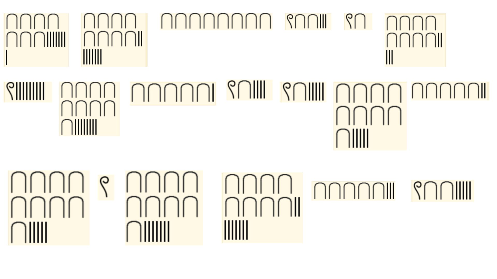

# Ancient Waves

**Challenge Type: Egypt Numbers**  

## Challenge

We have these funky looking waves which might have something more than meets the eye

## Solution 

1) Search in the cipher symbol identifer to eventually get the Egypt Numbers.
> Bruteforce time!
2) Convert them into numbers
3) Convert the numbers into ascii text
4) Flag: NYP{nUmb3rs_4_daY5}

## P.S

I'm not writing out them into numbers because I'm too lazy to do, you prolly get the idea. 