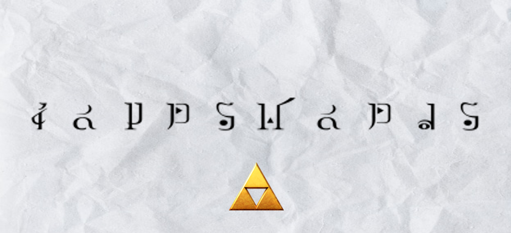

# Decrypting the Gamer's Code!

**Challenge Type: Hylian Language that I don't talk**  

## Challenge

My gamer friend told me to guess his least favourite character from a video game franchise. He gave me a paper with clues to make it easier. Help me in uncovering who his least favourite character is! Note that Password and Flag are both in uppercase.

 
7 ZIP Folder is included

## Solution 

1) Seeing the triforce we deduce that it is the 'twink' boy game: Legend of Zelda.
> This is the image to use: 
2) Translating it, we get: FOURSWORDS
3) Use it to open the 7 zip, and you get another 'twink' boy language
> Once again: 
4) Translate it again using this: 
5) Flag: NYP{GANONDOLF}

## P.S

I'm never playing zelda after this. Such a twink shouldn't be seen by the world. 