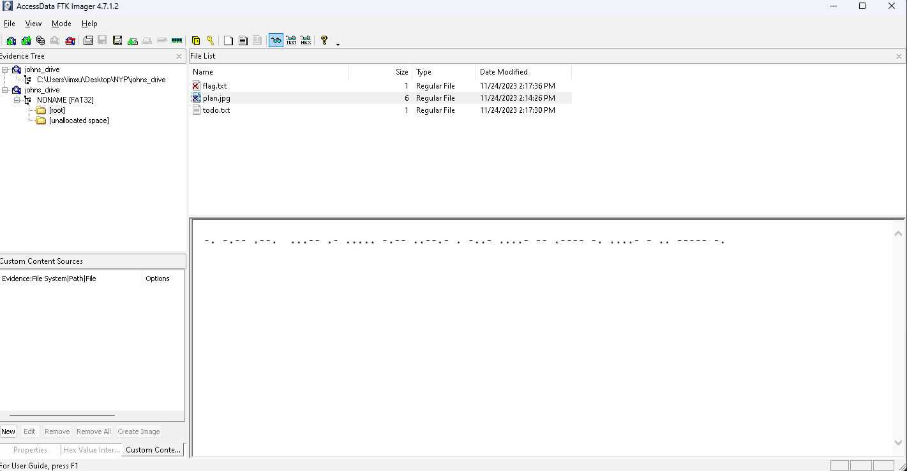

# A Little Help

**Challenge Type: Disk Analysis**  

## Challenge

You managed to obtained an image of a drive containing the escape plans of John. John was the last known person to have escaped the game. Examine it and locate the plans.

[John](../../../../NYP/johns_drive.zip)

## Solution 

1) Open up FTK Imager adding this as evidence
2) Clicking on the root folder, you shall encounter this page: 
> Those . and - indicates that this is morse code
3) Decrypting them you should get: NYP{3A5Y_EX4M1N4TI0N}

