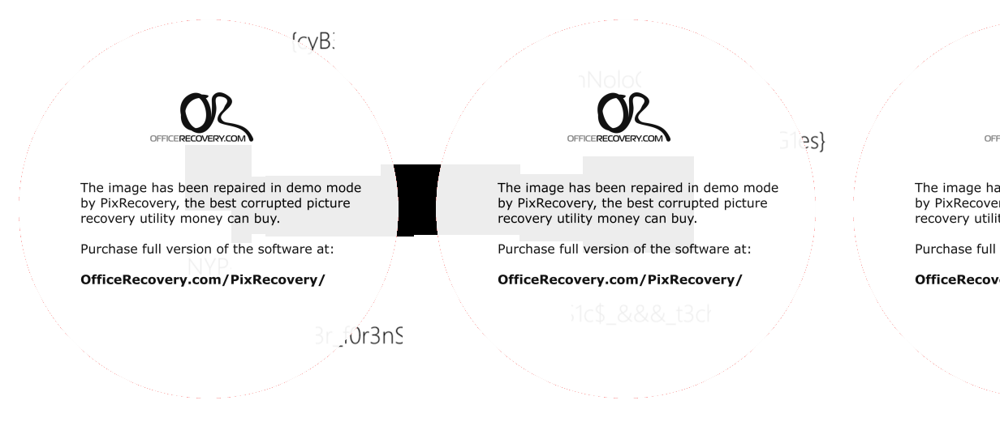

# Bruh

**Challenge Type: File Recovery**  

## Challenge

Wowzers, I can't open the file? Plz Help! Regards

## Solution 

1) FTK Imager it.
2) Search 'magic numbers' to see if .webp is the right file extension. 
3) When we see the first few hex code, we realize it is very close to .png but not quite so I suspected it is corrupted
4) Change it to .png and send it to be repaired.
5) Once done you will get this: 
6) Piece it together to get: NYP{cyB3r_f0r3nS1c$_&&&_t3chNoloG1es} 
