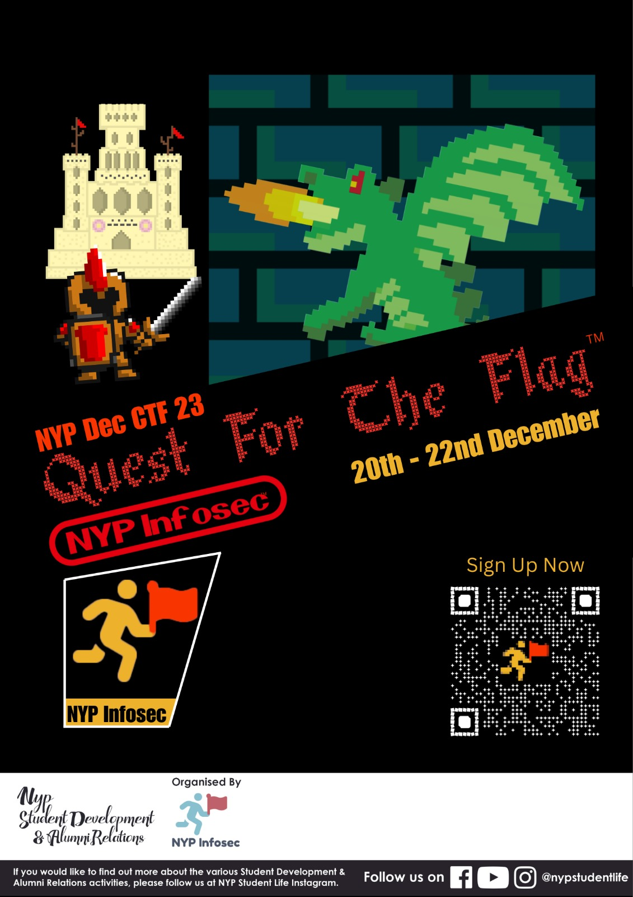

# Boss Encounter-The Cartridge King

**Challenge Type: Metadata** 

## Challenge

You enter a dungeon room. Inside, an old man lays on a simple plastic chair, surronding him are towers of retro video game boxes and catridges. He begins to speak: \n "I have collected every game in existance, yet theres one that eludes me constantly. Find the creator of the box art for creator of Quest For The Flag. You would find this journey beneficial to you too"

## Solution 

1) First we exiltool it to find the creator's name as westdemon
2) Westdemon is one of the exco of the discord so we go there and we find a base64 encrypted flag. 
3) Decrypting it gives us: NYP{mEEt_tHe_M@kEr}

## P.S

Bruhhhh if i didn't sent the ticket in the challenge, no way I would have gotten this one. 
 
Too much of a leap even for me. 
