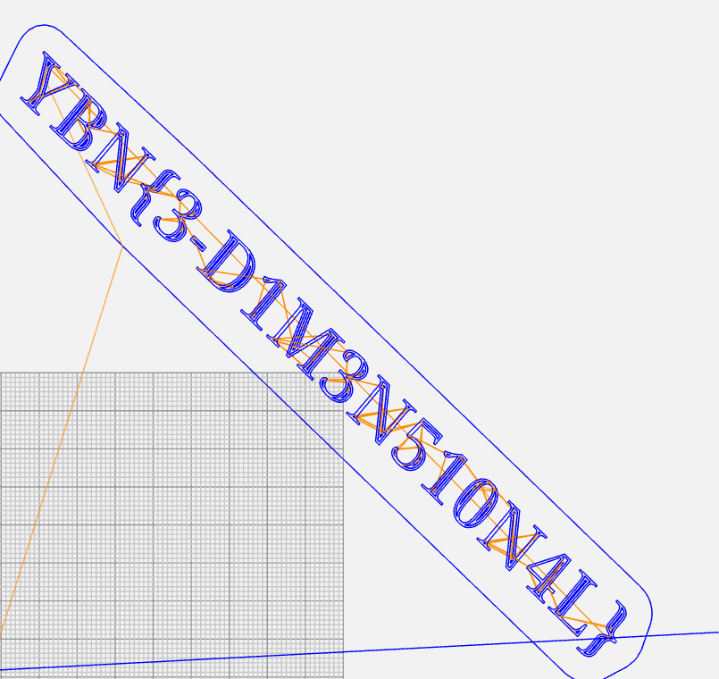

# Think in all dimensions

**Challenge Type: Misc**  

## Challenge

1 Dimension is a dot, 2 dimensions is a line
 
[File](Frantic_Inari-Esboo.txt)
 
## Solution 

1) Open the file to find engineering satanic languages
2) Copy some of the lines into google to understand this is G-Code
3) Find a G-Code Compiler online and let it run
4) Get this monstrosity: 

5) Flag: YBN{3-D1M3N510N4L}
### P.S 

Yeah I don't really know what is this about?  
Some engineering students prolly sneak into the IT safe zone  
And planted this here. 