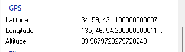

# Travelling Intern 2

**Challenge Type: Osint**  

## Challenge

Good work finding him! Oh wait he ran away...
 
Flag format: YBN{location_in_lowercase_seperated_by_underscores}
 
Note: The flag can only contain English characters (A-Z) and/or numerical characters (0-9), and the underscore character

## Solution 

1) Find the properties tabs from the image
2) Scroll to get this: 

3) Copy these cords and paste it on Google Maps
4) Try every single shop around this coordinate
5) Flag: YBN{asashi_tou_an_craft_shop}

### P.S

This is more forensics than OSINT ;-;;;; 
 
Also i hate tht i tried every shop around this damn place!