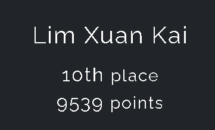

# WHO IS BACK FOR MORE INSANITYYYYYYY
 

Fun fact: IM NOT MENTALLY WELL
 

 

So let's get this writeup going:

### All solved challenge:

1. Poro [Link](https://github.com/limxuankai/CTF/blob/main/NYPInfosecDecCTF2023/Web/Poro.md)
2. Boss Encounter-The Robot In The Mirror [WIP]()
3. A Little Help [WIP]()
4. What am I [WIP]()
5. Shucks [WIP]()
6. RE Adventure 1 [Link](https://github.com/limxuankai/CTF/blob/main/NYPInfosecDecCTF2023/Reversing/RE_Adventure.md)
7. Running Man [WIP]()
8. Weeb [WIP]()
9. Forbidden Language [Link](https://github.com/limxuankai/CTF/blob/main/NYPInfosecDecCTF2023/Crypto/Forbidden_Language.md)
10. Ancient Waves [Link](https://github.com/limxuankai/CTF/blob/main/NYPInfosecDecCTF2023/Crypto/AncientWaves.md)
11. Which map did bro play on? [Link](https://github.com/limxuankai/CTF/blob/main/NYPInfosecDecCTF2023/Crypto/Which_Map_did_bro_play_on.md)
12. Advertisment [WIP]
13. Bruh [WIP]
14. Where am I [WIP]()
15. Games or No Games But Unlimited Games [Link](https://github.com/limxuankai/CTF/blob/main/NYPInfosecDecCTF2023/Web/GameOrNoGameButUnlimitedGames.md)
16. Decrypting the Gamer's Code [Link](https://github.com/limxuankai/CTF/blob/main/NYPInfosecDecCTF2023/Crypto/Decrypting_the_Gamer_Code.md)
17. Glitched and Lost [WIP]
18. Find me [WIP]
19. Boss Encounter-The Cartridge King [WIP]
20. I'm Xorry [Link](https://github.com/limxuankai/CTF/blob/main/NYPInfosecDecCTF2023/Crypto/Im_Xorry.md)
21. Ceaser is Fun [Link](https://github.com/limxuankai/CTF/blob/main/NYPInfosecDecCTF2023/Crypto/Ceaser_Is_Fun.md)
